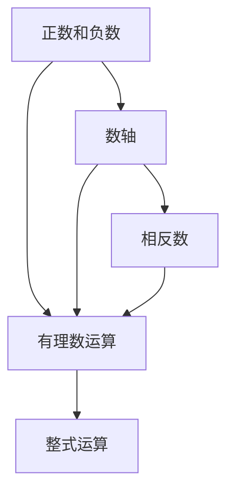
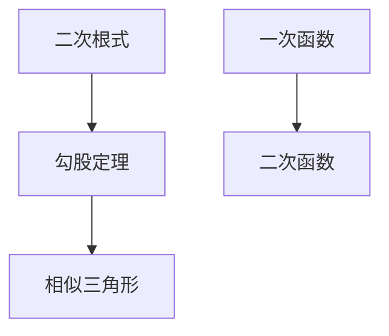

# 初中数学知识图谱

## 七年级

### 第一章 有理数

#### 1. 正数和负数
- **核心概念**：数的正负性质，用于表示量的大小和方向
- **认知层级**：理解
- **难度等级**：基础
- **前置知识**：
  * 自然数
  * 数的基本概念
- **重要性质**：
  * 正数大于0
  * 负数小于0
  * 0既不是正数也不是负数
- **应用场景**：
  * 温度变化
  * 海拔高度
  * 账目盈亏
  * 电梯楼层
- **常见误区**：
  * 负数的大小比较
  * 正负号与运算符号的混淆
- **教学建议**：
  * 结合生活实例
  * 使用数轴可视化
  * 多做比较练习

#### 2. 数轴
- **核心概念**：表示数的位置关系的直线工具
- **认知层级**：理解
- **难度等级**：基础
- **前置知识**：
  * 正数和负数
  * 数的大小比较
- **重要性质**：
  * 一一对应性
  * 有序性
  * 对称性
- **应用场景**：
  * 数的排序
  * 距离表示
  * 温度计刻度
- **常见误区**：
  * 方向的混淆
  * 单位刻度不均匀
- **教学建议**：
  * 使用实物教具
  * 强调零点位置
  * 练习数轴描点

#### 3. 有理数的运算
- **核心概念**：有理数的四则运算规则
- **认知层级**：应用
- **难度等级**：中等
- **前置知识**：
  * 正负数
  * 数轴
  * 运算顺序
- **重要性质**：
  * 加法交换律
  * 加法结合律
  * 乘法分配律
- **应用场景**：
  * 温度变化计算
  * 利润损失统计
  * 实际问题解决
- **常见误区**：
  * 同号异号判断错误
  * 运算顺序混乱
- **教学建议**：
  * 多做类型题练习
  * 使用实际例子
  * 注重运算法则

### 第二章 整式

#### 1. 字母表示数
- **核心概念**：用字母表示数的抽象概念
- **认知层级**：理解
- **难度等级**：中等
- **前置知识**：
  * 数的概念
  * 变量思想
- **应用场景**：
  * 数学公式表示
  * 规律总结
- **常见误区**：
  * 字母的具体值混淆
  * 变量与未知数概念混淆
- **教学建议**：
  * 从具体到抽象
  * 多用实例说明

[以下内容按照相同结构继续展开...]

## 八年级

### 第一章 二次根式

#### 1. 平方根
- **核心概念**：一个数的平方根是指它的平方等于该数的数
- **认知层级**：理解
- **难度等级**：中等
- **前置知识**：
  * 平方运算
  * 有理数运算
- **重要性质**：
  * 正数有两个平方根
  * 负数没有实数平方根
  * 零只有一个平方根
- **应用场景**：
  * 面积计算
  * 勾股定理
- **常见误区**：
  * 忽略负平方根
  * 与立方根混淆
- **教学建议**：
  * 几何直观引入
  * 数值估算训练

[更多内容继续按此结构展开...]

## 知识点关联图

### 七年级知识关联

### 八年级知识关联

## 教学策略建议

### 总体策略
1. 螺旋上升：基础知识逐步深化
2. 实践联系：结合实际应用
3. 错误预防：注意常见误区
4. 能力培养：注重思维方法

### 具体方法
1. 可视化教学
2. 实例引导
3. 练习巩固
4. 知识联系

## 应用场景举例

### 实际生活
1. 温度变化（有理数）
2. 购物计算（方程）
3. 建筑测量（几何）

### 学科交叉
1. 物理：函数关系
2. 化学：比例关系
3. 地理：统计图表 